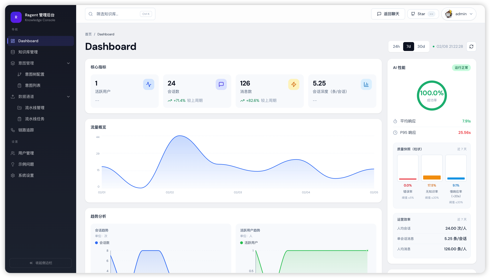

# RAGent - 企业级 RAG 智能体系统


> 一个基于 Spring Boot 3 + React 18 构建的企业级 RAG（检索增强生成）智能体系统，涵盖知识库管理、文档处理、智能问答、多轮对话等完整功能。

## 📖 项目简介

RAGent 是一个完整的 RAG 应用系统，从文档入库到智能问答全链路实现。项目采用前后端分离架构，后端基于 Spring Boot 3.5.7，前端使用 React 18，集成了向量数据库、消息队列、分布式缓存等企业级组件。

### 核心特性

- **🔍 多通道检索引擎** - 意图导向检索 + 关键词检索 + 全局向量检索并行执行，结果经去重、重排序后处理
- **🎯 意图识别与引导** - 树形多级意图分类（领域→类别→主题），低置信度时主动引导澄清
- **✍️ 查询改写与拆分** - 多轮对话自动补全上下文，复杂问题拆分为子问题分别检索
- **💬 会话记忆管理** - 滑动窗口保留近 N 轮对话，超限自动摘要压缩，控制 Token 成本
- **🔄 模型路由与容错** - 多模型优先级调度、首包探测、健康检查、自动降级
- **🛠️ MCP 工具集成** - 支持 Model Context Protocol 工具调用，检索与工具调用无缝融合
- **📄 文档处理流水线** - 支持 PDF/Word/Markdown 等格式，自动解析、分块、向量化、入库
- **📊 全链路追踪** - 每个环节（改写、意图、检索、生成）均有 Trace 记录，可追溯调优
- **🎨 管理后台** - React 管理界面，覆盖知识库管理、文档管理、链路追踪、系统设置

## 🏗️ 技术架构

### 技术栈

**后端技术栈**
- Java 17 + Spring Boot 3.5.7
- MyBatis-Plus 3.5.14
- PostgreSQL（关系型数据库）
- Redis + Redisson（缓存、分布式锁、限流）
- Milvus 2.6.6（向量数据库）
- RocketMQ 2.3.5（消息队列）
- Apache Tika 3.2.3（文档解析）
- Sa-Token 1.43.0（认证鉴权）

**前端技术栈**
- React 18
- TypeScript
- Vite（构建工具）
- Ant Design（UI 组件库）
- Axios（HTTP 客户端）

**AI 服务**
- Ollama（本地模型）
- Ollama（本地模型支持）
- 支持多模型路由与故障转移

### 模块结构

```
ragent/
├── backend/                # Java 后端源码
│   ├── bootstrap/          # 主应用模块（业务逻辑）
│   ├── framework/          # 基础设施框架（异常、上下文、AOP）
│   ├── infra-ai/           # AI 服务抽象层（LLM、Embedding）
│   ├── mcp-server/         # MCP 工具执行框架
│   └── resources/          # 资源文件（数据库脚本、配置）
├── frontend/               # React 前端源码
│   ├── src/                # 业务代码
│   └── public/             # 静态资源
├── docs/                   # 项目文档
│   ├── wiki/               # 13篇源码解析文档
│   ├── api/                # 接口文档
│   └── examples/           # 示例代码
├── config/                 # 全局配置
│   ├── docker-compose.yml  # Docker 编排
│   └── *.example.yaml      # 配置模板
├── scripts/                # 启动脚本
└── docker-data/            # Docker 数据持久化
```

## 🚀 快速开始

### 环境要求

- Java 17+
- Maven 3.8+
- Node.js 16+
- Docker & Docker Compose

### 1. 启动基础设施

```bash
cd config
docker-compose up -d
```

启动的服务包括：
- PostgreSQL (5432)
- Redis (6379)
- Milvus (19530)
- RocketMQ (9876, 10911)
- RustFS (9000)

### 2. 初始化数据库

```bash
# 连接 PostgreSQL
psql -U postgres -d ragent

# 执行初始化脚本
\i backend/resources/database/schema_pg.sql
\i backend/resources/database/init_data_pg.sql
```

### 3. 配置 API Key

```bash
# 复制配置模板
cp config/ragent-secrets.example.yaml config/dev/ragent-secrets.yaml

# 编辑配置文件，填入 Ollama 配置
vi config/dev/ragent-secrets.yaml
```

### 4. 启动后端

```bash
# 方式1：使用 Maven
cd backend
mvn clean package -DskipTests
java -jar bootstrap/target/ragent-0.0.1-SNAPSHOT.jar

# 方式2：使用启动脚本
./scripts/start-ragent.cmd    # Windows
./scripts/start-ragent.ps1    # PowerShell
```

后端服务启动在 `http://localhost:9090/api/ragent`

### 5. 启动前端

```bash
# 安装依赖
cd frontend
npm install

# 启动开发服务器
npm run dev

# 或使用启动脚本
../scripts/start-frontend.cmd    # Windows
../scripts/start-frontend.ps1    # PowerShell
```

前端服务启动在 `http://localhost:5173`

### 6. 验证安装

访问 `http://localhost:9090/api/ragent/actuator/health`，返回 `{"status":"UP"}` 表示后端启动成功。

访问 `http://localhost:5173`，看到登录页面表示前端启动成功。

## 📚 核心功能

### 1. 知识库管理

- 创建/编辑/删除知识库
- 知识库权限控制
- 知识库统计信息

### 2. 文档处理

- 支持 PDF、Word、Markdown、TXT 等格式
- 自动解析文档内容
- 智能分块（固定大小、语义分块）
- 批量向量化
- 异步入库处理

### 3. 智能问答

- 流式对话（SSE）
- 多轮对话上下文管理
- 查询改写与拆分
- 意图识别与引导
- 多通道并行检索
- 混合检索（语义 + 关键词）

### 4. 会话记忆

- 滑动窗口记忆（保留最近 N 轮）
- 自动摘要压缩
- Redis 缓存 + PostgreSQL 持久化

### 5. 模型管理

- 多模型配置
- 优先级调度
- 健康检查与熔断
- 自动故障转移

### 6. 链路追踪

- 全链路 Trace 记录
- 每个环节耗时统计
- 输入输出可追溯
- 异常信息记录

## 🎯 核心设计

### RAG 处理流程

```
用户提问
  ↓
会话记忆加载（Redis）
  ↓
查询改写与拆分（LLM）
  ↓
意图识别（树形分类）
  ↓
歧义引导判断
  ↓
多通道并行检索
  ├─ 意图导向检索（优先级1）
  ├─ 关键词检索（优先级2）
  └─ 全局向量检索（优先级3）
  ↓
后处理流水线
  ├─ 去重（混合评分）
  └─ 重排序（Rerank）
  ↓
Prompt 组装
  ↓
模型路由与调用
  ├─ 首包探测
  ├─ 健康检查
  └─ 自动降级
  ↓
流式输出（SSE）
  ↓
会话记忆更新
```

### 文档入库流程

```
文档上传
  ↓
文件存储（RustFS）
  ↓
消息队列（RocketMQ）
  ↓
文档解析（Apache Tika）
  ↓
文本分块（固定大小/语义分块）
  ↓
关键词提取（Ollama）
  ↓
批量向量化（Embedding API）
  ↓
向量存储（Milvus）
  ↓
元数据入库（PostgreSQL）
```

### 多通道检索架构

- **意图导向检索**：根据意图分类结果，在特定领域/类别下检索
- **关键词检索**：基于关键词匹配，适合精确查询
- **全局向量检索**：无过滤条件的全局语义检索

三个通道并行执行，结果融合后统一去重和重排序。

### 模型路由机制

- 配置多个候选模型，按优先级排序
- 首包探测：缓冲前几个事件，确认模型可用后再输出
- 健康检查：失败次数达到阈值自动熔断
- 自动降级：当前模型不可用时切换到下一个候选

## 📖 文档

完整的项目文档位于 `docs/wiki/` 目录，包含 13 篇详细的源码解析文档：

- [01-项目概览](docs/wiki/01-项目概览.md) - 项目介绍、技术栈、运行方式
- [02-目录结构解读](docs/wiki/02-目录结构解读.md) - 目录职责、模块划分
- [03-系统架构说明](docs/wiki/03-系统架构说明.md) - 分层架构、模块协作
- [04-启动流程](docs/wiki/04-启动流程.md) - 启动入口、初始化顺序
- [05-核心模块详解](docs/wiki/05-核心模块详解.md) - RAG、知识库、摄取、AI 抽象
- [06-关键业务流程](docs/wiki/06-关键业务流程.md) - 对话流程、文档处理
- [07-关键数据结构](docs/wiki/07-关键数据结构.md) - 实体类、DTO、配置对象
- [08-配置与环境](docs/wiki/08-配置与环境.md) - 配置文件、环境变量
- [09-外部依赖](docs/wiki/09-外部依赖.md) - 数据库、缓存、消息队列
- [10-隐式规则与约定](docs/wiki/10-隐式规则与约定.md) - 命名规范、异常处理
- [11-风险点与技术债](docs/wiki/11-风险点与技术债.md) - 已知问题、优化方向
- [12-新人上手路线](docs/wiki/12-新人上手路线.md) - 环境搭建、学习路径

更多文档请查看 [docs/README.md](docs/README.md)

## 🔧 开发指南

### 代码格式化

项目使用 Spotless 自动格式化代码：

```bash
# 手动格式化
mvn spotless:apply

# 编译时自动格式化
mvn compile
```

### 运行测试

```bash
# 运行所有测试
mvn clean test

# 运行单个测试类
mvn test -Dtest=ClassName -pl bootstrap
```

### 构建项目

```bash
# 完整构建
mvn clean package

# 跳过测试
mvn clean package -DskipTests

# 构建指定模块
mvn clean package -pl bootstrap
```

## 🎨 界面预览

### 用户问答界面


### 管理后台



## 🤝 贡献指南

欢迎提交 Issue 和 Pull Request！

1. Fork 本仓库
2. 创建特性分支 (`git checkout -b feature/AmazingFeature`)
3. 提交更改 (`git commit -m 'Add some AmazingFeature'`)
4. 推送到分支 (`git push origin feature/AmazingFeature`)
5. 提交 Pull Request

## 📄 开源协议

本项目采用 Apache 2.0 开源协议，详见 [LICENSE](LICENSE) 文件。

## 🙏 致谢

本项目参考了 [nageoffer/ragent](https://github.com/nageoffer/ragent) 的架构设计和实现思路，在此表示感谢。

## 📧 联系方式

如有问题或建议，欢迎提交 Issue 或通过以下方式联系：

- GitHub Issues: [提交问题](https://github.com/yourusername/ragent/issues)
- Email: your.email@example.com

---

**如果觉得项目有帮助，欢迎 Star ⭐ 支持一下！**
