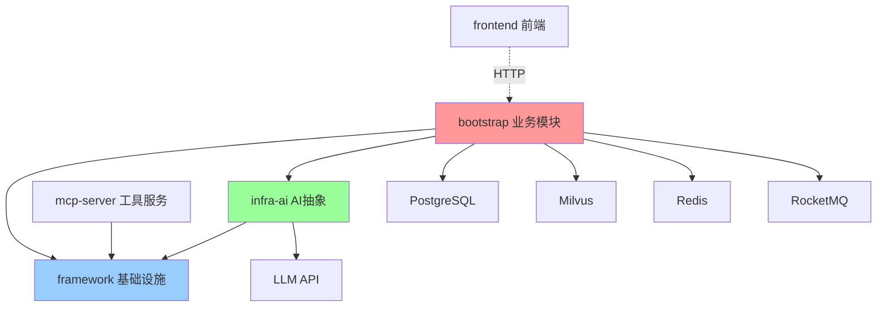
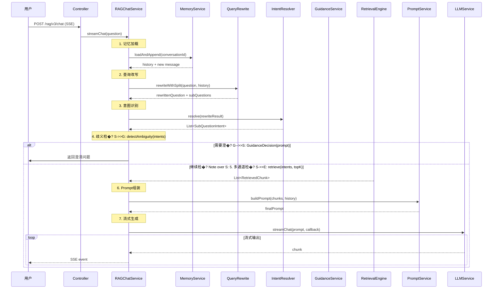
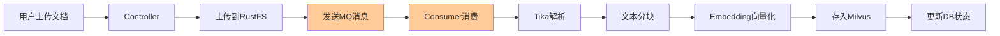
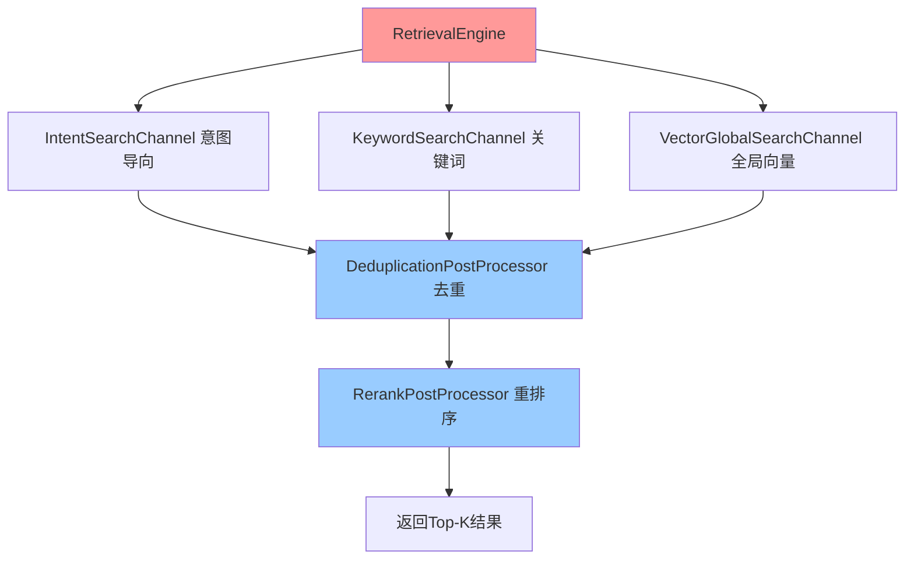

?# 系统架构说明

## 整体分层架构

KnowFlow 采用经典�?*分层架构 + 领域驱动设计（DDD�?*，从上到下分为：

```
┌─────────────────────────────────────────────────────────────�?�?                     接入�?(Controller)                      �?�? REST API / SSE Stream / WebSocket                           �?└─────────────────────────────────────────────────────────────�?                            �?┌─────────────────────────────────────────────────────────────�?�?                   业务服务�?(Service)                       �?�? 流程编排 / 业务逻辑 / 事务控制                                �?└─────────────────────────────────────────────────────────────�?                            �?┌─────────────────────────────────────────────────────────────�?�?                   领域核心�?(Core)                          �?�? 意图识别 / 检索引�?/ 记忆管理 / Prompt组装                   �?└─────────────────────────────────────────────────────────────�?                            �?┌─────────────────────────────────────────────────────────────�?�?                 基础设施�?(Infrastructure)                  �?�? AI抽象 / 向量存储 / 数据访问 / 消息队列 / 缓存               �?└─────────────────────────────────────────────────────────────�?                            �?┌─────────────────────────────────────────────────────────────�?�?                   外部依赖 (External)                        �?�? PostgreSQL / Milvus / Redis / RocketMQ / LLM API                 �?└─────────────────────────────────────────────────────────────�?```

## 模块协作关系

### 依赖关系�?


### 模块职责划分

| 层级 | 模块 | 职责 | 示例 |
|------|------|------|------|
| **接入�?* | Controller | 接收HTTP请求，参数校验，返回响应 | `RAGChatController.streamChat()` |
| **业务�?* | Service | 流程编排，业务规则，事务控制 | `RAGChatServiceImpl.streamChat()` |
| **领域�?* | Core | 领域逻辑，算法实现，无状态组�?| `IntentResolver.resolve()` |
| **基础设施�?* | Infra/DAO | 技术实现，外部系统交互 | `MilvusVectorStoreService` |
| **框架�?* | Framework | 跨领域基础能力 | `UserContext`, `@RagTraceNode` |

## 核心业务流程架构

### RAG 对话流程（最重要�?


### 文档摄取流程



### 多通道检索架�?


## 关键技术架�?
### 1. 线程池架�?
项目定义�?**8 个专用线程池**，避免线程竞争：

| 线程�?| 用�?| 核心线程�?| 最大线程数 |
|--------|------|-----------|-----------|
| `ragContextAssemblyExecutor` | 上下文格式化 | 2 | 4 |
| `multiChannelRetrievalExecutor` | 并行检�?| 4 | 8 |
| `intentClassificationExecutor` | 意图识别 | 2 | 4 |
| `memorySummarizationExecutor` | 记忆总结 | 1 | 2 |
| `modelStreamOutputExecutor` | SSE流输�?| 4 | 8 |
| `chatEntryPointExecutor` | 请求入口 | 2 | 4 |
| `mcpBatchExecutionExecutor` | MCP工具调用 | 2 | 4 |
| `internalRetrievalExecutor` | 子检索任�?| 2 | 4 |

**关键设计**：所有线程池都用 `TtlExecutors.getTtlExecutorService()` 包装，确�?`UserContext` �?ThreadLocal 变量能跨线程传递�?
### 2. 分布式限流架�?
```java
@ChatRateLimit  // AOP切面
public void streamChat(...) {
    // 业务逻辑
}
```

**实现原理**�?1. Redis Lua 脚本实现分布式信号量
2. 全局并发数限制（默认1，可配置�?3. 最大等待时�?秒，超时返回"系统繁忙"
4. 租约30秒自动释放，防止死锁

### 3. 链路追踪架构

```java
@RagTraceNode(name = "意图识别", type = TraceNodeType.INTENT)
public List<SubQuestionIntent> resolve(...) {
    // 自动记录输入、输出、耗时
}
```

**存储结构**�?- `t_rag_trace_task`：任务级别（一次对话）
- `t_rag_trace_node`：节点级别（每个环节�?- 可通过 `/rag/trace/{taskId}` 查询完整链路

### 4. 会话记忆架构

```
Redis Key: rag:memory:{conversationId}
TTL: 60分钟（可配置�?
存储结构�?{
  "messages": [
    {"role": "user", "content": "..."},
    {"role": "assistant", "content": "..."}
  ],
  "summary": "对话摘要（超�?轮后生成�?,
  "title": "对话标题"
}
```

**策略**�?- 保留最�?轮对话（可配置）
- 超过5轮自动触发总结
- 总结最�?00�?- 标题最�?0�?
### 5. 向量存储架构

支持两种向量数据库，通过 `rag.vector.type` 配置切换�?
#### Milvus 模式（推荐）
```yaml
rag.vector.type: milvus
```
- Collection 结构：`{knowledgeBaseId}_collection`
- 字段：`chunk_id`, `content`, `vector`, `keywords`, `metadata`
- 索引：HNSW（高性能近似最近邻�?
#### Milvus 模式（正式方案）
```yaml
rag.vector.type: milvus
```
- 向量数据存储�?Milvus Collection �?- 关系型元数据与链路追踪存储在 PostgreSQL
- 适合正式环境的独立扩缩容

### 6. 模型路由架构

```yaml
ai.chat.candidates:
  - id: qwen2.5-ollama
    provider: ollama
    priority: 0        # 优先级越低越优先
    enabled: true
  - id: qwen2.5-ollama
    provider: ollama
    priority: 100      # 备用模型
    enabled: false
```

**故障转移策略**�?1. 按优先级排序候选模�?2. 首包探测：发送请求后等待第一个token
3. 如果超时或失败，立即切换下一个模�?4. 熔断机制：连续失�?次后暂时跳过�?0秒）

## 数据流向

### 写入流程（文档上传）
```
用户 �?Controller �?RustFS �?RocketMQ �?Consumer �?Tika �?Chunker �?Embedding �?Milvus + PostgreSQL
```

### 读取流程（对话查询）
```
用户 �?Controller �?Service �?RetrievalEngine �?Milvus �?PostProcessor �?PromptService �?LLM �?SSE �?用户
```

### 记忆流程（会话管理）
```
对话开�?�?Redis加载历史 �?追加新消�?�?检查是否需要总结 �?异步总结 �?更新Redis �?设置TTL
```

## 关键设计原则

1. **单一职责**：每个模块只做一件事（framework不包含业务逻辑�?2. **依赖倒置**：业务层依赖抽象接口（`LLMService`），不依赖具体实�?3. **开闭原�?*：新增检索通道、后处理器无需修改核心代码
4. **异步解�?*：文档处理用MQ异步，避免阻塞用户请�?5. **故障隔离**：线程池隔离、熔断机制、超时控�?6. **可观测�?*：全链路追踪、详细日志、性能指标

