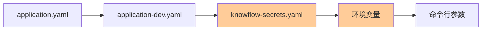

?# 启动流程

## 项目启动入口

### 主启动类

**文件位置**：`bootstrap/src/main/java/com/nageoffer/ai/knowflow/KnowFlowApplication.java`

```java
@SpringBootApplication
@MapperScan("com.nageoffer.ai.knowflow.**.dao.mapper")
public class KnowFlowApplication {
    public static void main(String[] args) {
        SpringApplication.run(KnowFlowApplication.class, args);
    }
}
```

**关键注解**�?- `@SpringBootApplication`：标�?Spring Boot 启动�?- `@MapperScan`：扫描所有模块的 MyBatis Mapper 接口

### 启动命令

```bash
# 方式1：直接运行jar包（推荐生产环境�?java -jar bootstrap/target/knowflow-0.0.1-SNAPSHOT.jar

# 方式2：Maven插件运行（开发环境）
mvn spring-boot:run -pl bootstrap

# 方式3：IDE运行
# 直接运行 KnowFlowApplication.main()

# 方式4：使用启动脚本（Windows�?start-knowflow.cmd
```

## 初始化流程详�?
### 1. 配置加载顺序



**配置文件优先�?*（从低到高）�?1. `application.yaml`：基础配置
2. `application-{profile}.yaml`：环境特定配置（�?`application-dev.yaml`�?3. `knowflow-secrets.yaml`：敏感信息（通过 `spring.config.import: optional:file:./knowflow-secrets.yaml` 导入�?4. 环境变量：如 `OLLAMA_BASE_URL`
5. 命令行参数：�?`--server.port=8080`

**关键配置�?*�?```yaml
spring:
  profiles:
    active: dev  # 激活的环境
  config:
    import: optional:file:./knowflow-secrets.yaml  # 导入敏感配置
```

### 2. Bean 初始化顺�?
Spring Boot 启动时按以下顺序初始化组件：

#### 阶段1：基础设施 Bean（framework 模块�?```
1. SnowflakeIdGenerator        # 雪花ID生成�?2. RedisTemplate                # Redis客户�?3. RedissonClient               # Redisson分布式锁
4. UserContextInterceptor       # 用户上下文拦截器
```

#### 阶段2：数据访问层（bootstrap/dao�?```
1. DataSource (HikariCP)        # 数据库连接池
2. MyBatis SqlSessionFactory    # MyBatis会话工厂
3. Mapper接口代理对象            # 自动扫描生成
```

#### 阶段3：AI 基础设施（infra-ai 模块�?```
1. AIProviderConfig             # 加载AI服务商配�?2. OllamaChatClient            # 智谱AI客户�?3. OllamaChatClient             # Ollama客户�?4. RoutingLLMService            # LLM路由服务
5. EmbeddingService             # Embedding服务
6. KeywordExtractor             # 关键词提取器
```

#### 阶段4：向量存储（bootstrap/rag/core/vector�?```
1. MilvusClient                 # Milvus客户端（如果启用�?2. MilvusVectorStoreService     # Milvus向量存储服务
3. MilvusVectorStoreAdmin       # Milvus 集合管理
```

**关键判断**：根�?`rag.vector.type` 配置决定初始化哪个向量存储实现�?
#### 阶段5：线程池（bootstrap/rag/config�?```
ThreadPoolExecutorConfig 初始�?个专用线程池�?- ragContextAssemblyExecutor
- multiChannelRetrievalExecutor
- intentClassificationExecutor
- memorySummarizationExecutor
- modelStreamOutputExecutor
- chatEntryPointExecutor
- mcpBatchExecutionExecutor
- internalRetrievalExecutor
```

**关键代码**�?```java
@Bean("ragContextAssemblyExecutor")
public ExecutorService ragContextAssemblyExecutor() {
    return TtlExecutors.getTtlExecutorService(
        new ThreadPoolExecutor(2, 4, 60L, TimeUnit.SECONDS, 
            new LinkedBlockingQueue<>(100),
            new ThreadFactoryBuilder().setNameFormat("rag-context-%d").build())
    );
}
```

#### 阶段6：核心业务组件（bootstrap/rag/core�?```
1. PromptTemplateLoader         # 加载Prompt模板
2. IntentResolver               # 意图识别�?3. QueryRewriteService          # 查询改写服务
4. ConversationMemoryService    # 会话记忆服务
5. IntentGuidanceService        # 歧义引导服务
6. RetrievalEngine              # 检索引�?7. RAGPromptService             # Prompt组装服务
```

#### 阶段7：检索通道（bootstrap/rag/core/retrieve/channel�?```
1. IntentMilvusSearchChannel    # 意图导向检�?2. KeywordMilvusSearchChannel   # 关键词检�?3. VectorGlobalSearchChannel    # 全局向量检�?```

**自动注册机制**�?```java
@Component
public class IntentMilvusSearchChannel implements SearchChannel {
    @Override
    public int priority() {
        return 1;  // 优先级最�?    }
}
```
`RetrievalEngine` 通过 Spring 自动注入所�?`SearchChannel` 实现，并按优先级排序�?
#### 阶段8：后处理器（bootstrap/rag/core/retrieve/postprocessor�?```
1. DeduplicationPostProcessor   # 去重
2. RerankPostProcessor          # 重排序（如果启用�?```

#### 阶段9：业务服务层（bootstrap/*/service�?```
1. KnowledgeBaseService         # 知识库服�?2. KnowledgeDocumentService     # 文档服务
3. KnowledgeChunkService        # 分块服务
4. RAGChatService               # 对话服务
5. UserService                  # 用户服务
```

#### 阶段10：控制器层（bootstrap/*/controller�?```
1. RAGChatController            # 对话API
2. KnowledgeBaseController      # 知识库API
3. UserController               # 用户API
```

#### 阶段11：定时任务（bootstrap/knowledge/scheduler�?```
1. KnowledgeDocumentScheduler   # 文档扫描定时任务
   - 扫描PENDING/RUNNING状态的文档
   - 恢复超时文档
   - �?0秒执行一次（可配置）
```

#### 阶段12：消息队列消费者（bootstrap/ingestion/consumer�?```
1. DocumentIngestionConsumer    # 文档摄取消费�?   - 监听 RocketMQ Topic
   - 处理文档解析、分块、向量化
```

### 3. 路由注册

Spring MVC 自动扫描 `@RestController` �?`@RequestMapping` 注解，注册以下路由：

**核心 API 路由**�?```
POST   /api/knowflow/rag/v3/chat              # SSE流式对话
GET    /api/knowflow/rag/settings             # 获取RAG设置
POST   /api/knowflow/knowledge/base           # 创建知识�?POST   /api/knowflow/knowledge/document       # 上传文档
GET    /api/knowflow/knowledge/chunk          # 查询分块
POST   /api/knowflow/user/login               # 用户登录
GET    /api/knowflow/rag/trace/{taskId}       # 查询链路追踪
```

**路由前缀**：`server.servlet.context-path: /api/knowflow`

### 4. 定时任务启动

```java
@Scheduled(fixedDelayString = "${rag.knowledge.schedule.scan-delay-ms:10000}")
public void scanAndProcessDocuments() {
    // 1. 获取分布式锁
    RLock lock = redissonClient.getLock("rag:document:scan");
    
    // 2. 扫描待处理文�?    List<KnowledgeDocumentDO> documents = documentMapper.selectList(
        new LambdaQueryWrapper<KnowledgeDocumentDO>()
            .in(KnowledgeDocumentDO::getStatus, PENDING, RUNNING)
            .last("LIMIT " + batchSize)
    );
    
    // 3. 恢复超时文档
    // 4. 触发处理
}
```

**启动时机**：应用启动后10秒开始第一次扫描�?
### 5. 健康检�?
Spring Boot Actuator 自动注册健康检查端点（如果启用）：
```
GET /actuator/health
```

返回示例�?```json
{
  "status": "UP",
  "components": {
    "db": {"status": "UP"},
    "redis": {"status": "UP"},
    "diskSpace": {"status": "UP"}
  }
}
```

## 启动失败常见原因

### 1. 数据库连接失�?```
Error: Could not connect to PostgreSQL
```
**解决**：检�?`docker-compose.yml` 中的 PostgreSQL 是否启动�?
### 2. Redis 连接失败
```
Error: Unable to connect to Redis at 127.0.0.1:6379
```
**解决**：检�?Redis 是否启动，密码是否正确（默认 `123456`）�?
### 3. Milvus 连接失败
```
Error: Failed to connect to Milvus at localhost:19530
```
**解决**�?- 检�?Milvus 是否启动
- 检�?`milvus.uri` 配置�?Milvus 服务状�?
### 4. API Key 未配�?```
Warn: OLLAMA_BASE_URL not configured, chat service may fail
```
**解决**：在 `knowflow-secrets.yaml` 中配置：
```yaml
ai:
  providers:
    ollama:
      url: http://localhost:11434
```

### 5. 端口被占�?```
Error: Port 9090 is already in use
```
**解决**：修�?`server.port` 或停止占用端口的进程�?
## 启动日志关键信息

**成功启动的标�?*�?```
2026-04-08 12:00:00.123  INFO 12345 --- [main] c.n.a.r.KnowFlowApplication : Started KnowFlowApplication in 8.234 seconds
2026-04-08 12:00:00.456  INFO 12345 --- [main] o.s.b.w.e.tomcat.TomcatWebServer : Tomcat started on port(s): 9090 (http)
2026-04-08 12:00:00.789  INFO 12345 --- [main] c.n.a.r.rag.core.vector.MilvusVectorStoreService : Milvus connection established
2026-04-08 12:00:01.012  INFO 12345 --- [main] c.n.a.r.knowledge.scheduler.KnowledgeDocumentScheduler : Document scanner started
```

**关键检查点**�?1. �?Tomcat 启动成功（端口监听）
2. �?数据库连接池初始�?3. �?Redis 连接成功
4. �?Milvus 连接成功
5. �?定时任务启动
6. �?RocketMQ 消费者启�?
## 启动性能优化

### 1. 跳过测试
```bash
mvn clean package -DskipTests
```

### 2. 并行构建
```bash
mvn clean package -T 4  # 使用4个线�?```

### 3. 延迟初始化（开发环境）
```yaml
spring:
  main:
    lazy-initialization: true  # 延迟初始化Bean
```

### 4. 减少日志输出
```yaml
logging:
  level:
    root: warn  # 生产环境建议warn
```

## 启动后验�?
### 1. 检查API可用�?```bash
curl http://localhost:9090/api/knowflow/actuator/health
```

### 2. 测试对话接口
```bash
curl -X POST http://localhost:9090/api/knowflow/rag/v3/chat \
  -H "Content-Type: application/json" \
  -H "Authorization: Bearer YOUR_TOKEN" \
  -d '{
    "question": "你好",
    "conversationId": "test-123"
  }'
```

### 3. 查看日志
```bash
tail -f app.log
```

### 4. 检查数据库�?```sql
SELECT table_name FROM information_schema.tables 
WHERE table_schema = 'public' AND table_name LIKE 't_%';
```

应该看到�?- `t_knowledge_base`
- `t_knowledge_document`
- `t_knowledge_chunk`
- `t_rag_trace_task`
- `t_rag_trace_node`
- `t_user`
- �?
