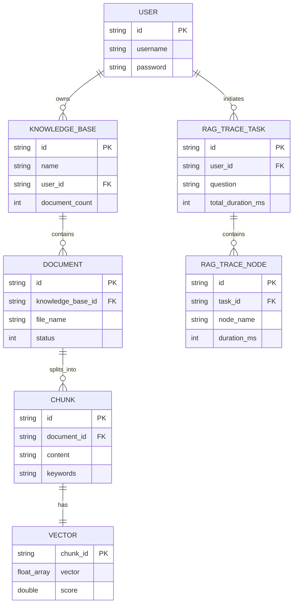

?# 关键数据结构与领域模�?
## 1. 核心实体（DO - Data Object�?
### 1.1 KnowledgeBaseDO
**表名**：`t_knowledge_base`  
**路径**：`bootstrap/src/main/java/com/nageoffer/ai/ragent/knowledge/dao/entity/KnowledgeBaseDO.java`

**字段说明**�?```java
public class KnowledgeBaseDO {
    private String id;              // 雪花ID，主�?    private String name;            // 知识库名�?    private String description;     // 描述
    private String userId;          // 所属用户ID
    private Integer documentCount;  // 文档数量
    private Integer chunkCount;     // 分块总数
    private LocalDateTime createTime;
    private LocalDateTime updateTime;
    private Integer delFlag;        // 删除标记�?-未删除，1-已删除）
}
```

**生命周期**�?- 创建：用户调用创建知识库API
- 更新：文档上传时更新 `documentCount` �?`chunkCount`
- 删除：软删除（`delFlag=1`），级联删除文档和向量数�?
**关系**�?- 一对多：一个知识库包含多个文档（`KnowledgeDocumentDO`�?- 一对多：一个知识库对应一�?Milvus Collection

---

### 1.2 KnowledgeDocumentDO
**表名**：`t_knowledge_document`  
**路径**：`bootstrap/src/main/java/com/nageoffer/ai/ragent/knowledge/dao/entity/KnowledgeDocumentDO.java`

**字段说明**�?```java
public class KnowledgeDocumentDO {
    private String id;                  // 雪花ID
    private String knowledgeBaseId;     // 所属知识库ID
    private String fileName;            // 文件名（如：技术文�?pdf�?    private String fileUrl;             // RustFS存储URL
    private Long fileSize;              // 文件大小（字节）
    private String fileType;            // 文件类型（pdf/docx/md�?    private Integer status;             // 状态：0-待处理，1-处理中，2-已完成，3-失败
    private Integer chunkCount;         // 分块数量
    private String errorMessage;        // 失败原因
    private LocalDateTime createTime;
    private LocalDateTime updateTime;
    private Integer delFlag;
}
```

**状态流�?*�?```
PENDING(0) �?RUNNING(1) �?COMPLETED(2)
    �?           �?  FAILED(3)   TIMEOUT �?PENDING(0)
```

**生命周期**�?- 创建：用户上传文档，状态为 `PENDING`
- 处理中：MQ消费者开始处理，状态变�?`RUNNING`
- 完成：处理成功，状态变�?`COMPLETED`，更�?`chunkCount`
- 失败：处理异常，状态变�?`FAILED`，记�?`errorMessage`
- 超时恢复：定时任务检�?`RUNNING` 超过5分钟，重置为 `PENDING`

**关系**�?- 多对一：多个文档属于一个知识库
- 一对多：一个文档包含多个分块（`KnowledgeChunkDO`�?
---

### 1.3 KnowledgeChunkDO
**表名**：`t_knowledge_chunk`  
**路径**：`bootstrap/src/main/java/com/nageoffer/ai/ragent/knowledge/dao/entity/KnowledgeChunkDO.java`

**字段说明**�?```java
public class KnowledgeChunkDO {
    private String id;                  // 雪花ID（也是Milvus的chunk_id�?    private String knowledgeBaseId;     // 所属知识库ID
    private String documentId;          // 所属文档ID
    private String content;             // 分块文本内容（最�?000字符�?    private String keywords;            // 关键词（逗号分隔，如�?RAG,检�?向量"�?    private Integer position;           // 在文档中的位置（第几块）
    private Integer tokenCount;         // Token数量
    private String metadata;            // 元数据JSON（如：{"page": 3, "section": "2.1"}�?    private LocalDateTime createTime;
    private Integer delFlag;
}
```

**生命周期**�?- 创建：文档处理时批量插入
- 查询：检索时根据向量相似度返�?- 删除：文档删除时级联删除

**关系**�?- 多对一：多个分块属于一个文�?- 一对一：每个分块在 Milvus 中有对应的向量记�?
**关键设计**�?- `id` 同时作为 PostgreSQL 主键�?Milvus �?`chunk_id`，确保数据一致�?- `keywords` 字段支持关键词检索通道
- `metadata` 存储额外信息（页码、章节等），用于结果展示

---

### 1.4 UserDO
**表名**：`t_user`  
**路径**：`bootstrap/src/main/java/com/nageoffer/ai/ragent/user/dao/entity/UserDO.java`

**字段说明**�?```java
public class UserDO {
    private String id;              // 雪花ID
    private String username;        // 用户名（唯一�?    private String password;        // 密码（BCrypt加密�?    private String nickname;        // 昵称
    private String email;           // 邮箱
    private String phone;           // 手机�?    private Integer status;         // 状态：0-正常�?-禁用
    private LocalDateTime createTime;
    private LocalDateTime updateTime;
    private Integer delFlag;
}
```

**生命周期**�?- 注册：创建用户记录，密码加密存储
- 登录：验证密码，生成 Sa-Token
- 使用：通过 `UserContext` 在请求中传递用户ID

---

### 1.5 RagTraceTaskDO
**表名**：`t_rag_trace_task`  
**路径**：`bootstrap/src/main/java/com/nageoffer/ai/ragent/rag/dao/entity/RagTraceTaskDO.java`

**字段说明**�?```java
public class RagTraceTaskDO {
    private String id;                  // 任务ID（雪花ID�?    private String conversationId;      // 会话ID
    private String userId;              // 用户ID
    private String question;            // 用户问题
    private String answer;              // 助手回答
    private Integer totalDurationMs;    // 总耗时（毫秒）
    private Integer nodeCount;          // 节点数量
    private LocalDateTime createTime;
}
```

**生命周期**�?- 创建：对话开始时创建任务记录
- 更新：对话结束时更新 `answer` �?`totalDurationMs`
- 查询：通过 `/rag/trace/{taskId}` 查询完整链路

**关系**�?- 一对多：一个任务包含多个追踪节点（`RagTraceNodeDO`�?
---

### 1.6 RagTraceNodeDO
**表名**：`t_rag_trace_node`  
**路径**：`bootstrap/src/main/java/com/nageoffer/ai/ragent/rag/dao/entity/RagTraceNodeDO.java`

**字段说明**�?```java
public class RagTraceNodeDO {
    private String id;              // 雪花ID
    private String taskId;          // 所属任务ID
    private String nodeName;        // 节点名称（如�?意图识别"�?    private String nodeType;        // 节点类型（MEMORY/REWRITE/INTENT/RETRIEVAL/GENERATION�?    private Integer durationMs;     // 耗时（毫秒）
    private String input;           // 输入数据（JSON�?    private String output;          // 输出数据（JSON�?    private String errorMessage;    // 错误信息（如果失败）
    private LocalDateTime createTime;
}
```

**节点类型枚举**�?```java
public enum TraceNodeType {
    MEMORY,         // 记忆加载
    REWRITE,        // 查询改写
    INTENT,         // 意图识别
    GUIDANCE,       // 歧义引导
    RETRIEVAL,      // 检�?    MCP_TOOL,       // MCP工具调用
    PROMPT,         // Prompt组装
    GENERATION      // LLM生成
}
```

**生命周期**�?- 创建：通过 `@RagTraceNode` AOP 自动记录
- 查询：与任务一起查询，展示完整链路

---

## 2. 数据传输对象（DTO�?
### 2.1 ChatRequest
**路径**：`framework/src/main/java/com/nageoffer/ai/ragent/framework/convention/ChatRequest.java`

**字段说明**�?```java
public class ChatRequest {
    private String question;            // 用户问题
    private String conversationId;      // 会话ID（可选，首次为空�?    private Boolean deepThinking;       // 是否启用深度思考（默认false�?    private String modelId;             // 指定模型ID（可选）
    private Integer topK;               // 检索Top-K（默�?�?}
```

**使用场景**：前端调�?`/rag/v3/chat` 时传�?
---

### 2.2 ChatMessage
**路径**：`framework/src/main/java/com/nageoffer/ai/ragent/framework/convention/ChatMessage.java`

**字段说明**�?```java
public class ChatMessage {
    private String role;        // 角色：user/assistant/system
    private String content;     // 消息内容
    private Long timestamp;     // 时间�?    
    // 工厂方法
    public static ChatMessage user(String content) { ... }
    public static ChatMessage assistant(String content) { ... }
    public static ChatMessage system(String content) { ... }
}
```

**使用场景**�?- 会话记忆存储
- Prompt 组装
- 历史对话展示

---

### 2.3 RewriteResult
**路径**：`bootstrap/src/main/java/com/nageoffer/ai/ragent/rag/core/rewrite/RewriteResult.java`

**字段说明**�?```java
public record RewriteResult(
    String rewrittenQuestion,           // 改写后的完整问题
    List<SubQuestion> subQuestions      // 拆分的子问题列表
) {}

public record SubQuestion(
    String question,                    // 子问题文�?    double relevance                    // 相关性分数（0-1�?) {}
```

**生命周期**�?- 创建：`QueryRewriteService.rewriteWithSplit()` 返回
- 使用：传递给 `IntentResolver` 进行意图识别
- 销毁：对话流程结束后释�?
---

### 2.4 SubQuestionIntent
**路径**：`bootstrap/src/main/java/com/nageoffer/ai/ragent/rag/dto/SubQuestionIntent.java`

**字段说明**�?```java
public class SubQuestionIntent {
    private SubQuestion subQuestion;    // 子问�?    private String domain;              // 领域（技�?产品/通用�?    private String category;            // 类别（API文档/架构设计/代码实现�?    private String topic;               // 主题（具体关注点�?    private double confidence;          // 置信度（0-1�?    private IntentType intentType;      // 意图类型（QUERY/TOOL_CALL�?}
```

**意图类型枚举**�?```java
public enum IntentType {
    QUERY,          // 普通查询（检索知识库�?    TOOL_CALL       // 工具调用（执行MCP工具�?}
```

**生命周期**�?- 创建：`IntentResolver.resolve()` 返回
- 使用：传递给 `RetrievalEngine` �?`IntentGuidanceService`
- 销毁：检索完成后释放

---

### 2.5 RetrievalContext
**路径**：`bootstrap/src/main/java/com/nageoffer/ai/ragent/rag/dto/RetrievalContext.java`

**字段说明**�?```java
public class RetrievalContext {
    private List<Chunk> chunks;             // 检索到的分块列�?    private Map<String, Object> metadata;   // 元数据（如：检索耗时、通道信息�?    
    public int getTotalChunks() {
        return chunks.size();
    }
    
    public List<String> getSources() {
        return chunks.stream()
            .map(Chunk::getSource)
            .distinct()
            .toList();
    }
}
```

**生命周期**�?- 创建：`RetrievalEngine.retrieve()` 返回
- 使用：传递给 `RAGPromptService` 组装 Prompt
- 销毁：Prompt 组装完成后释�?
---

### 2.6 Chunk（分块数据）
**路径**：`bootstrap/src/main/java/com/nageoffer/ai/ragent/core/chunk/VectorChunk.java`

**字段说明**�?```java
public class VectorChunk {
    private String chunkId;         // 分块ID（对应数据库记录�?    private String content;         // 文本内容
    private float[] vector;         // 向量�?536维）
    private List<String> keywords;  // 关键词列�?    private double score;           // 相似度分数（0-1�?    private String source;          // 来源（文件名 + 位置�?    private Map<String, Object> metadata;  // 元数�?}
```

**生命周期**�?- 创建：从 Milvus 检索返�?- 使用：后处理（去�?重排）、Prompt 组装
- 销毁：对话流程结束后释�?
---

## 3. 配置对象

### 3.1 AIProviderConfig
**路径**：`infra-ai/src/main/java/com/nageoffer/ai/ragent/infra/config/AIProviderConfig.java`

**字段说明**�?```java
@ConfigurationProperties(prefix = "ai.providers")
public class AIProviderConfig {
    private Map<String, ProviderSettings> providers;  // 服务商配�?    
    public static class ProviderSettings {
        private String url;             // API地址
        private String apiKey;          // API密钥
        private Map<String, String> endpoints;  // 端点映射
    }
}
```

**配置示例**�?```yaml
ai:
  providers:
    ollama:
      url: http://localhost:11434
      url: ${OLLAMA_BASE_URL}
      endpoints:
        chat: /chat/completions
        embedding: /embeddings
```

---

### 3.2 ModelCandidateConfig
**路径**：`infra-ai/src/main/java/com/nageoffer/ai/ragent/infra/config/ModelCandidateConfig.java`

**字段说明**�?```java
@ConfigurationProperties(prefix = "ai.chat")
public class ModelCandidateConfig {
    private String defaultModel;            // 默认模型ID
    private List<ModelCandidate> candidates;  // 候选模型列�?    
    public static class ModelCandidate {
        private String id;              // 模型ID
        private String provider;        // 服务�?        private String model;           // 模型名称
        private int priority;           // 优先级（越小越优先）
        private boolean enabled;        // 是否启用
        private boolean supportsThinking;  // 是否支持深度思�?    }
}
```

**配置示例**�?```yaml
ai:
  chat:
    default-model: qwen2.5-ollama
    candidates:
      - id: qwen2.5-ollama
        provider: ollama
        model: qwen2.5-ollama
        priority: 0
        enabled: true
```

---

## 4. 领域模型关系�?


---

## 5. 数据流转示例

### 文档上传到检索的完整数据�?
```
1. 用户上传 PDF
   �?2. KnowledgeDocumentDO (status=PENDING)
   �?3. MQ 消息 (DocumentIngestionMessage)
   �?4. 解析 �?文本内容 (String)
   �?5. 分块 �?List<TextChunk>
   �?6. 向量�?�?List<float[]>
   �?7. 关键词提�?�?List<List<String>>
   �?8. 存储 �?Milvus (VectorChunk) + PostgreSQL (KnowledgeChunkDO)
   �?9. 用户提问 �?检�?�?返回 List<VectorChunk>
   �?10. Prompt 组装 �?LLM 生成 �?回答
```

---

## 6. 重要字段说明

### 6.1 status 字段（文档状态）
```java
public interface DocumentStatus {
    int PENDING = 0;    // 待处�?    int RUNNING = 1;    // 处理�?    int COMPLETED = 2;  // 已完�?    int FAILED = 3;     // 失败
}
```

### 6.2 delFlag 字段（软删除标记�?```java
public interface DelFlag {
    int NORMAL = 0;     // 正常
    int DELETED = 1;    // 已删�?}
```

**查询时自动过�?*�?```java
@TableLogic
private Integer delFlag;  // MyBatis-Plus 自动处理
```

### 6.3 vector 字段（向量数据）
- **维度**�?536（智谱AI Embedding-3 模型�?- **类型**：`float[]`（Java�? `FLOAT_VECTOR`（Milvus�?- **存储**：仅存储�?Milvus，PostgreSQL 不存储向�?
### 6.4 keywords 字段（关键词�?- **格式**：逗号分隔字符串（如："RAG,检�?向量"�?- **来源**：Ollama 关键词提取器
- **用�?*：关键词检索通道

### 6.5 metadata 字段（元数据�?- **格式**：JSON 字符�?- **示例**：`{"page": 3, "section": "2.1", "author": "张三"}`
- **用�?*：结果展示、来源追�?
