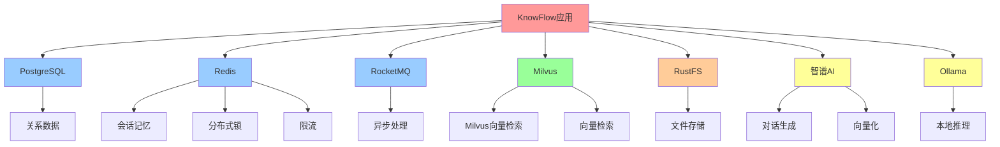

?# 外部依赖

## 1. 数据�?
### 1.1 PostgreSQL 16

**版本要求**：MySQL 8.0+

**用�?*�?- 关系数据存储（用户、知识库、文档、分块）
- 链路追踪数据存储
- 向量检索继续使�?Milvus，关系型数据统一�?PostgreSQL

**使用位置**�?- `bootstrap/src/main/java/com/nageoffer/ai/knowflow/**/dao/mapper/`：所�?MyBatis Mapper
- `KnowledgeBaseServiceImpl`：知识库 CRUD
- `KnowledgeDocumentServiceImpl`：文档管�?- `KnowledgeChunkServiceImpl`：分块管�?- `RagTraceQueryServiceImpl`：链路追踪查�?
**核心�?*�?```sql
-- 知识�?t_knowledge_base (id, name, description, user_id, document_count, chunk_count)

-- 文档
t_knowledge_document (id, knowledge_base_id, file_name, file_url, status, chunk_count)

-- 分块
t_knowledge_chunk (id, knowledge_base_id, document_id, content, keywords, position)

-- 用户
t_user (id, username, password, nickname, email)

-- 链路追踪
t_rag_trace_task (id, conversation_id, question, answer, total_duration_ms)
t_rag_trace_node (id, task_id, node_name, node_type, duration_ms, input, output)

-- 文件元数据（v1.2+�?t_file_metadata (id, file_name, file_url, file_size, file_category, knowledge_base_id)
```

**连接配置**�?```yaml
spring:
  datasource:
    url: jdbc:postgresql://127.0.0.1:5432/knowflow?client_encoding=UTF8
    username: postgres
    password: postgres
```

**Docker 启动**�?```bash
docker-compose up -d postgres
```

**初始�?*�?```bash
psql -h 127.0.0.1 -U postgres -d knowflow -f backend/resources/database/schema_pg.sql
psql -h 127.0.0.1 -U postgres -d knowflow -f backend/resources/database/init_data_pg.sql
```

**性能优化**�?- 索引：`knowledge_base_id`、`document_id`、`status`、`user_id`
- 连接池：HikariCP（最大连接数根据并发调整�?- 慢查询日志：`log_min_duration_statement = 1000`

---

### 1.2 Milvus

**版本要求**：Milvus 2.6+

**用�?*�?- 替代 Milvus 的向量存储方�?- 适合小规模数据（< 10万条�?
**安装**：使�?`docker-compose up -d milvus-standalone` 启动 Milvus 服务�?
**使用位置**�?- `MilvusVectorStoreService`：向量存储实�?- `MilvusVectorStoreAdmin`：Collection 管理
- 正式运行固定使用 `rag.vector.type: milvus`

**表结�?*�?```sql
{
    "collection_name": "{knowledgeBaseId}_collection",
    "schema": {
        "chunk_id": "VARCHAR(64)",
        "content": "VARCHAR(5000)",
        "vector": "FLOAT_VECTOR(1536)",
        "keywords": "VARCHAR(512)",
        "metadata": "JSON"
    }
}
```

**切换方式**�?```yaml
rag:
  vector:
    type: milvus
```

**优缺�?*�?- �?优点：部署简单，无需额外服务
- �?缺点：性能不如 Milvus，不适合大规模数�?
---

## 2. 缓存

### 2.1 Redis

**版本要求**：Redis 6.0+（推�?7.0+�?
**用�?*�?1. **会话记忆存储**（TTL 60分钟�?   - Key: `rag:memory:{conversationId}`
   - 存储：对话历史、总结、标�?2. **分布式锁**
   - Key: `rag:document:scan`（文档扫描锁�?   - 实现：Redisson `RLock`
3. **分布式信号量**
   - Key: `rag:document:upload`（上传并发控制）
   - Key: `rag:rate-limit:global:{userId}`（全局限流�?4. **幂等性控�?*
   - Key: `rag:idempotent:{requestId}`
   - TTL: 5�?5. **Sa-Token 会话存储**
   - Key: `satoken:login:token:{token}`

**使用位置**�?- `ConversationMemoryService`：会话记�?- `ChatRateLimitAspect`：限�?- `IdempotentSubmitAspect`：幂�?- `KnowledgeDocumentScheduler`：分布式�?- `KnowledgeDocumentServiceImpl`：信号量

**连接配置**�?```yaml
spring:
  data:
    redis:
      host: 127.0.0.1
      port: 6379
      password: 123456
```

**Docker 启动**�?```bash
docker-compose up -d redis
```

**监控命令**�?```bash
# 查看内存使用
redis-cli -a 123456 INFO memory

# 查看Key数量
redis-cli -a 123456 DBSIZE

# 查看慢查�?redis-cli -a 123456 SLOWLOG GET 10
```

**性能优化**�?- 连接池：Lettuce（默认）
- 序列化：Jackson2JsonRedisSerializer
- 过期策略：定期删�?+ 惰性删�?
---

## 3. 消息队列

### 3.1 RocketMQ

**版本要求**：RocketMQ 4.9+（推�?5.0+�?
**用�?*�?- 异步文档处理（解析、分块、向量化�?- 解耦上传和处理流程

**Topic**�?- `document-ingestion-topic`：文档摄取主�?
**使用位置**�?- `KnowledgeDocumentServiceImpl.uploadDocument()`：生产者，发送消�?- `DocumentIngestionConsumer`：消费者，处理文档

**消息结构**�?```java
public class DocumentIngestionMessage {
    private String documentId;      // 文档ID
    private String knowledgeBaseId; // 知识库ID
    private Long timestamp;         // 时间�?}
```

**连接配置**�?```yaml
rocketmq:
  name-server: 127.0.0.1:9876
  producer:
    group: knowflow-producer_pg
    send-message-timeout: 2000
  consumer:
    consume-thread-min: 2
    consume-thread-max: 4
```

**Docker 启动**�?```bash
docker-compose up -d rocketmq-namesrv rocketmq-broker
```

**监控**�?- Dashboard: http://localhost:8080（如果启用）
- 命令行：`mqadmin topicStatus -n localhost:9876 -t document-ingestion-topic`

**消费失败处理**�?- 自动重试：最�?�?- 死信队列：`%DLQ%knowflow-consumer`
- 手动恢复：定时任务扫�?`FAILED` 状态文�?
---

## 4. 向量数据�?
### 4.1 Milvus

**版本要求**：Milvus 2.3+（推�?2.6+�?
**用�?*�?- 主向量存储方�?- 高性能向量检索（HNSW索引�?- 支持元数据过�?
**使用位置**�?- `MilvusVectorStoreService`：向量存储操�?- `MilvusVectorStoreAdmin`：Collection管理
- `IntentMilvusSearchChannel`：意图导向检�?- `KeywordMilvusSearchChannel`：关键词检�?- `VectorGlobalSearchChannel`：全局向量检�?
**Collection 结构**�?```python
{
    "collection_name": "{knowledgeBaseId}_collection",
    "schema": {
        "chunk_id": "VARCHAR(64)",      # 主键
        "content": "VARCHAR(5000)",     # 文本内容
        "vector": "FLOAT_VECTOR(1536)", # 向量
        "keywords": "VARCHAR(512)",     # 关键�?        "metadata": "JSON"              # 元数�?    },
    "index": {
        "field": "vector",
        "type": "HNSW",
        "params": {"M": 16, "efConstruction": 200}
    }
}
```

**连接配置**�?```yaml
milvus:
  uri: http://localhost:19530
  token: ""  # 如果启用认证

rag:
  vector:
    type: milvus
  default:
    dimension: 1536
    metric-type: COSINE
```

**Docker 启动**�?```bash
docker-compose up -d milvus-standalone
```

**管理操作**�?```java
// 创建Collection
milvusVectorStoreAdmin.createCollection(collectionName, dimension, metricType);

// 创建索引
milvusVectorStoreAdmin.createIndex(collectionName, "vector", "HNSW", params);

// 插入向量
milvusVectorStoreService.batchInsert(knowledgeBaseId, chunks, vectors, keywords);

// 检�?List<VectorChunk> results = milvusVectorStoreService.search(
    knowledgeBaseId, 
    queryVector, 
    topK, 
    filter  // 元数据过�?);
```

**性能优化**�?- 索引类型：HNSW（高性能�?- 分片数：根据数据量调�?- 副本数：生产环境建议 >= 2
- 缓存：启用查询结果缓�?
**监控**�?- Attu（Web UI）：http://localhost:3000
- Metrics：Prometheus + Grafana

---

## 5. 文件存储

### 5.1 RustFS（S3兼容�?
**版本要求**：任�?S3 兼容存储（MinIO、AWS S3、阿里云OSS�?
**用�?*�?- 文档文件存储（PDF、DOCX、Markdown等）
- 支持大文件上传（最�?00MB�?
**使用位置**�?- `KnowledgeDocumentServiceImpl.uploadDocument()`：上传文�?- `DocumentIngestionConsumer`：下载文件进行处�?
**连接配置**�?```yaml
rustfs:
  url: http://localhost:9000
  access-key-id: dummy
  secret-access-key: dummy
  bucket-name: knowflow
```

**Docker 启动**�?```bash
docker-compose up -d rustfs
```

**文件路径规则**�?```
http://localhost:9000/knowflow/documents/{date}/{uuid}.{ext}
示例：http://localhost:9000/knowflow/documents/20260408/abc123.pdf
```

**API 操作**�?```java
// 上传
String fileUrl = rustFsClient.upload(file);

// 下载
byte[] fileBytes = rustFsClient.download(fileUrl);

// 删除
rustFsClient.delete(fileUrl);
```

**生产环境替换**�?- AWS S3：修�?`rustfs.url` �?S3 Endpoint
- 阿里云OSS：修改为 OSS Endpoint
- MinIO：自�?MinIO 集群

---

## 6. AI服务

### 6.1 智谱AI（GLM�?
**用�?*�?- 对话生成（GLM-4.6v-flashx�?- 文本向量化（Embedding-3�?536维）
- 查询改写、意图识别、总结

**使用位置**�?- `OllamaChatClient`：对话客户端
- `OllamaEmbeddingClient`：向量化客户�?- `RoutingLLMService`：通过路由层调�?
**API配置**�?```yaml
ai:
  providers:
    ollama:
      url: http://localhost:11434
      url: ${OLLAMA_BASE_URL}
      endpoints:
        chat: /chat/completions
        embedding: /embeddings
```

**获取API Key**�?1. 注册：https://localhost:11434/
2. 创建API Key
3. 配置�?`knowflow-secrets.yaml`

**费用**�?- Qwen 2.5：约 ¥0.001/千tokens
- Embedding-3：约 ¥0.0005/千tokens

**限流**�?- 免费额度：有限制
- 付费用户：根据套�?
---

### 6.2 Ollama（本地模型）

**版本要求**：Ollama 0.1.0+

**用�?*�?- 本地对话生成（qwen2.5:0.5b�?- 本地向量化（qwen2.5:0.5b�?96维）
- 关键词提�?- 完全离线部署

**使用位置**�?- `OllamaChatClient`：对话客户端
- `OllamaEmbeddingClient`：向量化客户�?- `KeywordExtractor`：关键词提取

**安装**�?```bash
# 安装 Ollama
curl -fsSL https://ollama.com/install.sh | sh

# 启动服务
ollama serve

# 拉取模型
ollama pull qwen2.5:0.5b
```

**配置**�?```yaml
ai:
  providers:
    ollama:
      url: http://localhost:11434
  
  chat:
    candidates:
      - id: qwen2.5-ollama
        provider: ollama
        model: qwen2.5:0.5b
        priority: 100  # 备用模型
        enabled: true
  
  embedding:
    candidates:
      - id: qwen2.5-ollama-embed
        provider: ollama
        model: qwen2.5:0.5b
        dimension: 896  # 注意：与智谱AI不同
        enabled: true
```

**注意事项**�?- ⚠️ 向量维度不同�?96 vs 1536），需单独配置 Milvus Collection
- ⚠️ 性能较云端模型低，适合测试和离线场�?- ⚠️ 模型文件较大（qwen2.5:0.5b �?300MB�?
**推荐模型**�?- 对话：`qwen2.5:0.5b`（轻量）、`llama3:8b`（高质量�?- 向量化：`nomic-embed-text`（专用Embedding模型�?
---

## 7. 依赖关系�?


---

## 8. 依赖启动顺序

### 8.1 最小依赖（必需�?
```bash
# 1. PostgreSQL（必需�?docker-compose up -d postgres

# 2. Redis（必需�?docker-compose up -d redis

# 3. RustFS（必需�?docker-compose up -d rustfs

# 4. RocketMQ（必需�?docker-compose up -d rocketmq-namesrv rocketmq-broker
```

### 8.2 可选依�?
```bash
# Milvus（必需�?docker-compose up -d milvus-standalone

# Ollama（可选，本地模型�?ollama serve
```

### 8.3 一键启�?
```bash
# 启动所有依�?docker-compose up -d

# 检查状�?docker-compose ps
```

---

## 9. 依赖健康检�?
### 9.1 PostgreSQL
```bash
psql -h 127.0.0.1 -U postgres -d knowflow -c "SELECT 1"
```

### 9.2 Redis
```bash
redis-cli -a 123456 PING
# 期望输出：PONG
```

### 9.3 RocketMQ
```bash
mqadmin clusterList -n localhost:9876
```

### 9.4 Milvus
```bash
curl http://localhost:19530/healthz
# 期望输出：OK
```

### 9.5 RustFS
```bash
curl http://localhost:9000/minio/health/live
# 期望输出�?00 OK
```

### 9.6 智谱AI
```bash
curl -X POST http://localhost:11434/api/chat \
  -H "Authorization: Bearer YOUR_API_KEY" \
  -H "Content-Type: application/json" \
  -d '{"model":"qwen2.5-ollama","messages":[{"role":"user","content":"test"}]}'
```

### 9.7 Ollama
```bash
curl http://localhost:11434/api/tags
# 期望输出：已安装的模型列�?```

---

## 10. 依赖故障处理

### 10.1 PostgreSQL连接失败
```
Error: Connection refused
```
**排查**�?1. 检查容器状态：`docker-compose ps postgres`
2. 检查端口：`netstat -an | grep 5432`
3. 检查日志：`docker-compose logs postgres`

### 10.2 Redis连接失败
```
Error: Unable to connect to Redis
```
**排查**�?1. 检查密码：`spring.data.redis.password`
2. 检查端口：`netstat -an | grep 6379`
3. 测试连接：`redis-cli -a 123456 PING`

### 10.3 Milvus连接失败
```
Error: Failed to connect to Milvus
```
**排查**�?1. 检查容器：`docker-compose ps milvus-standalone`
2. 检查日志：`docker-compose logs milvus-standalone`
3. 检�?`milvus.uri` �?Milvus 服务健康状�?
### 10.4 RocketMQ消费失败
```
Error: No route info of this topic
```
**排查**�?1. 检查NameServer：`mqadmin clusterList -n localhost:9876`
2. 创建Topic：`mqadmin updateTopic -n localhost:9876 -t document-ingestion-topic -c DefaultCluster`
3. 检查消费者组：`mqadmin consumerProgress -n localhost:9876 -g knowflow-consumer`

### 10.5 智谱AI调用失败
```
Error: 401 Unauthorized
```
**排查**�?1. 检查API Key：`echo $OLLAMA_BASE_URL`
2. 检查余额：登录智谱AI控制�?3. 切换到Ollama：`ai.chat.candidates[1].enabled: true`

---

## 11. 生产环境建议

### 11.1 高可用部�?
- **PostgreSQL**：主从复�?+ 读写分离
- **Redis**：哨兵模式或集群模式
- **RocketMQ**：多Master多Slave
- **Milvus**：分布式集群（多节点�?- **RustFS**：对象存储集群（MinIO集群或云存储�?
### 11.2 监控告警

- **数据�?*：慢查询、连接数、磁盘空�?- **Redis**：内存使用、命中率、慢查询
- **RocketMQ**：消息堆积、消费延�?- **Milvus**：查询延迟、索引状�?- **AI服务**：调用成功率、响应时间、费�?
### 11.3 备份策略

- **PostgreSQL**：每日全量备�?+ Binlog 归档
- **Redis**：RDB + AOF
- **Milvus**：定期导出Collection
- **RustFS**：对象存储自带冗�?

